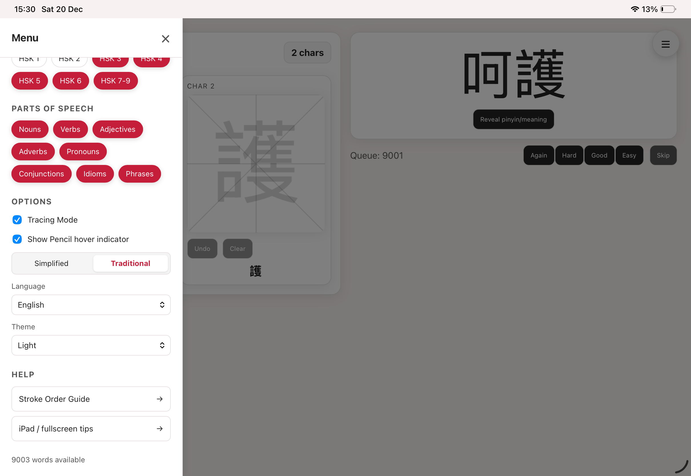
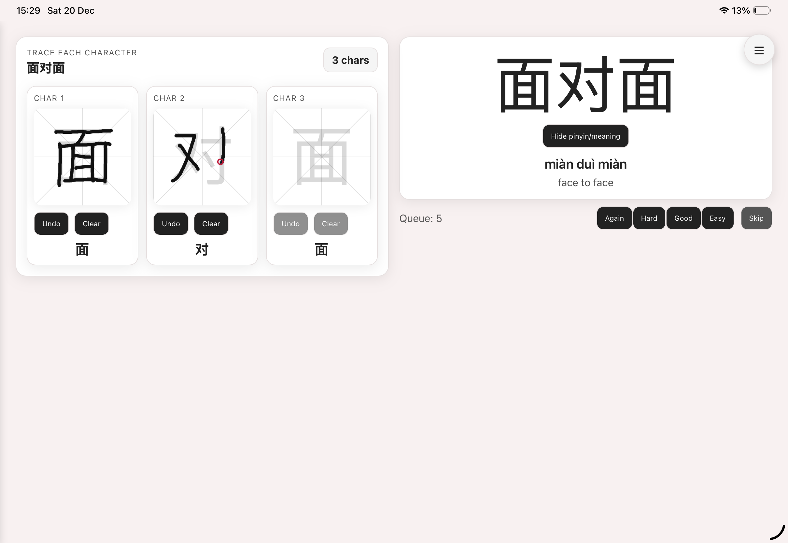
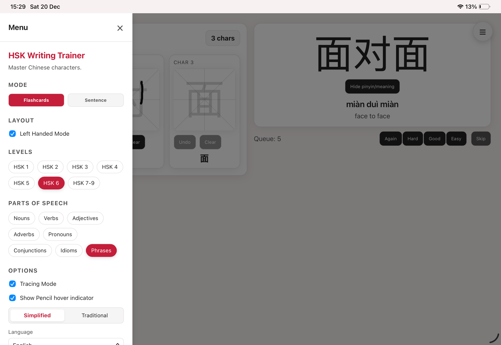
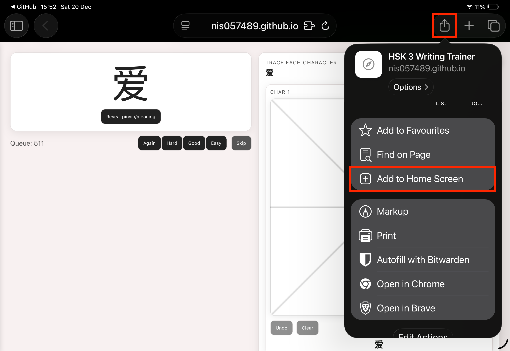
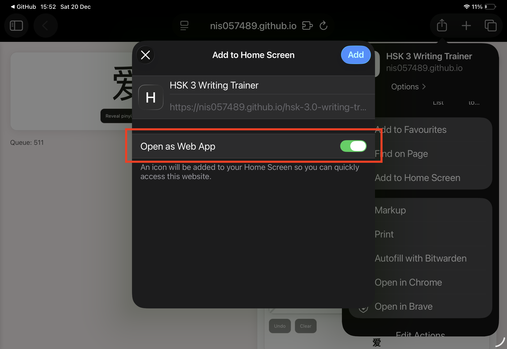

# HSK Writing Trainer (HSK 3.0 friendly)

Practice handwriting for the HSK with a tablet-ready React app. Trace characters, drill with spaced repetition, and switch UI languages to match how you study.

## Live demo

Try the hosted version: <https://nis057489.github.io/hsk-3.0-writing-trainer/>

## Why learners like it

- Spaced repetition flashcards plus sentence tracing to mimic HSK writing prompts
- Tracing grid with palm/pinch blocking; optional Pencil hover indicator (M2 iPad Pro + Pencil 2)
- Multi-language UI: English, 简体中文, 繁體中文, Español, Français, Tiếng Việt, Filipino, 한국어, العربية, Русский, Türkçe, हिन्दी, فارسی, Português
- Themes: Light, Dark, High Contrast, or follow system
- Remembers your language/theme/preferences between sessions

## How to use

1) Open the menu (☰) → choose Flashcard or Sentence mode.  
2) Flashcard mode: tap a card to reveal pinyin/meaning, then grade (Again/Hard/Good/Easy). Queue orders itself with spaced repetition.  
3) Sentence mode: paste/type characters and trace each box.  
4) Toggle tracing mode for a light character watermark, and switch Simplified/Traditional display.  
5) Set left-handed layout if you hold the iPad/Pencil on the left.

## Tip — install on iPad (recommended)

For the best tablet experience (no browser chrome, better fullscreen), add the site to your iPad Home Screen from Safari.

1. Open the site in Safari on your iPad.
2. Tap the Share button (the square with an arrow).
3. Choose "Add to Home Screen".
4. In the add dialog, confirm the name and tap "Add". If an "Open as Web App" / "Open as App" option appears, keep it enabled so the site launches fullscreen.
5. Launch the app from your Home Screen.

Note: Pencil hover and some fullscreen behaviors require Safari and recent iPad hardware (e.g., M2 iPad Pro + Apple Pencil 2). PWAs or other browsers may behave differently.

## Credits

Shout out to @drkameleon for the JSON vocabulary source: [@drkameleon’s HSK lists](https://github.com/drkameleon/complete-hsk-vocabulary/tree/main). Thanks!
